<h1 align="center">LinguaLink</h1>

<p align="center">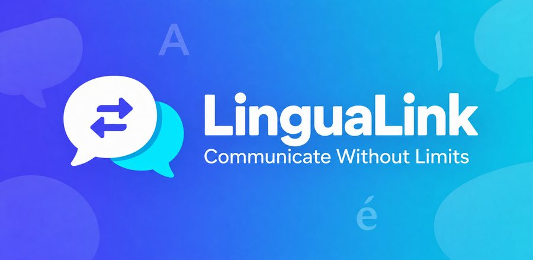</p>

<p align="center"><b>Speak your language, hear theirs — real-time translated chat, calls, and media.</b></p>

<p align="center">
  <a href="https://play.google.com/store/apps/details?id=com.translate.ai"><b>▶ Get it on Google Play</b></a> ·
  <a href="https://github.com/ObaidaAlaff/lingualink-code-sample"><b>💻 Code sample</b></a>
</p>

<p align="center">
  
  
  
  
  
  
  
  
</p>

## Overview

LinguaLink removes the language barrier from everyday communication. Two people chat, call, and exchange voice notes while each side reads and hears their own language — translation happens inside the pipeline, not as a manual step the user has to trigger.

It's built for people who work, study, or stay in touch across a language gap. Beyond messaging, it includes a pronunciation trainer and a studio that translates uploaded audio and video files. Four languages — Arabic, English, Italian, and Spanish — are supported end to end, with full RTL layout and a light/dark theme. The app is **published on Google Play** (v1.3).

## Features

- **Four languages** — Arabic, English, Italian, and Spanish; pick yours once at sign-up
- **Auto-translated messaging** — each participant reads in their own language; the original is one tap away
- **Voice notes with spoken translation** — the recipient hears the message in their language, with transcript and translation inline
- **Video messages with burned-in subtitles** — timed transcription produces an SRT that ffmpeg renders onto the video
- **Image text translation** — snap a sign, document, or screen; OCR extracts the text and translates it
- **Multi-language group chats** — join by invite code or discover public groups; every member reads every message in their own language, live
- **Live translated calls** — audio and video over Agora with real-time captions streamed via WebSocket
- **Translation Studio** — translate any audio, video, image, or text file without a chat, and save the result
- **Pronunciation practice** — scored exercises with word-by-word accuracy, fluency, and completeness feedback
- **Subscription tiers** — free through unlimited, with usage metering for messages and minutes
- **Bidirectional by design** — correct RTL mirroring throughout, plus a separately designed dark theme

## Screenshots

### From the Google Play listing

<table>
  <tr>
    <td align="center">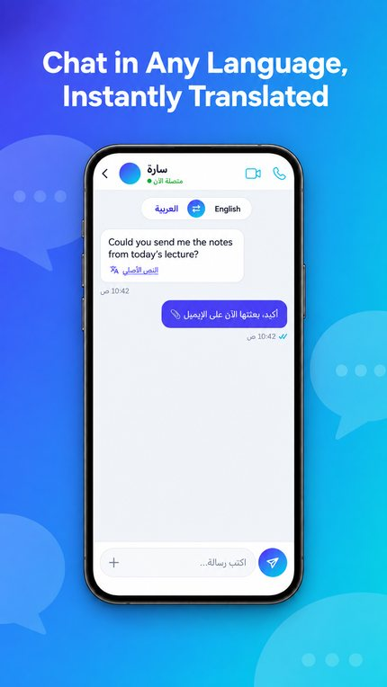</td>
    <td align="center">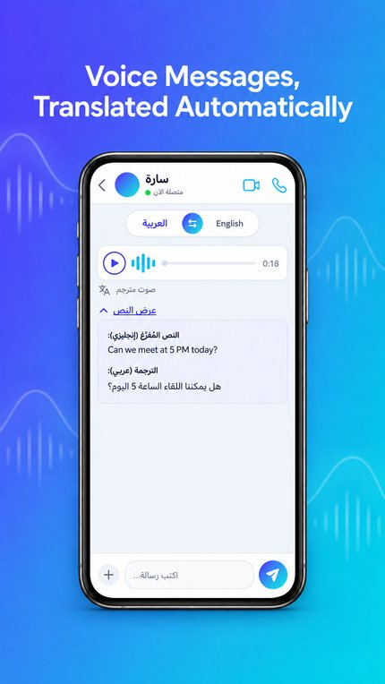</td>
    <td align="center">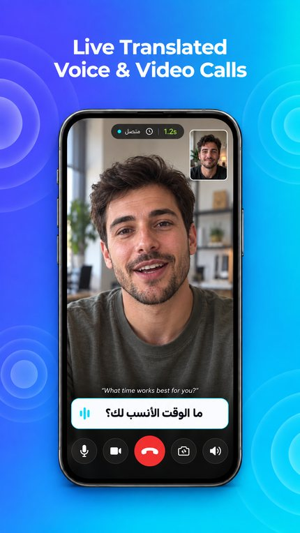</td>
    <td align="center">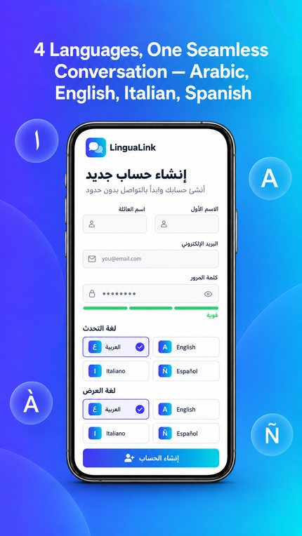</td>
    <td align="center">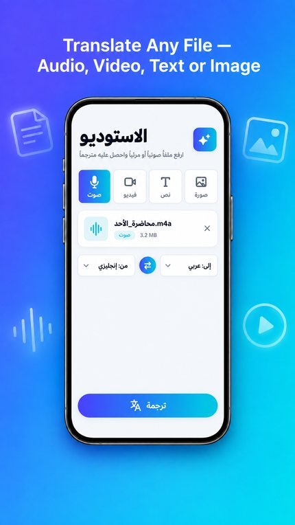</td>
    <td align="center">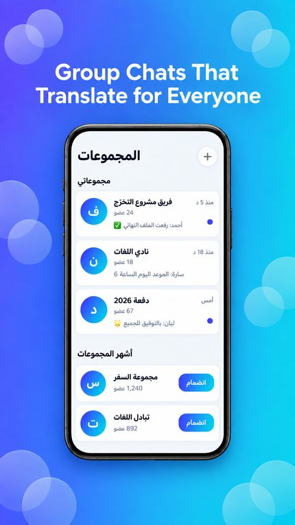</td>
  </tr>
  <tr>
    <td align="center">Chat in any language</td>
    <td align="center">Voice messages translated</td>
    <td align="center">Live translated calls</td>
    <td align="center">4 languages, one conversation</td>
    <td align="center">Studio for any file</td>
    <td align="center">Multi-language groups</td>
  </tr>
</table>

### In the app

### Messaging

| Chats | Conversation | Voice pipeline |
|:---:|:---:|:---:|
| 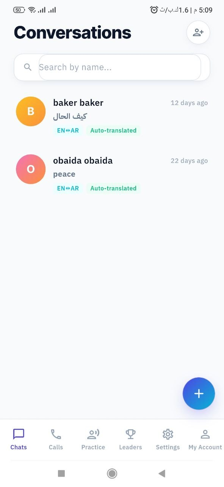 | 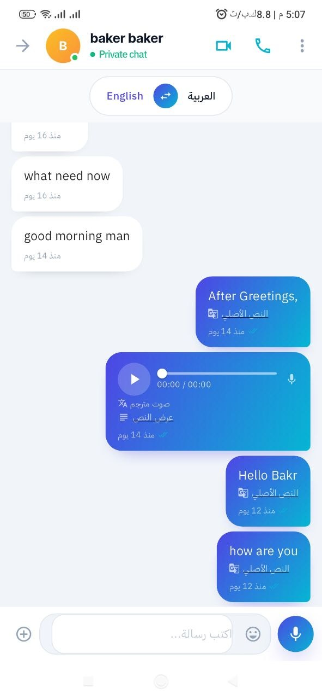 | 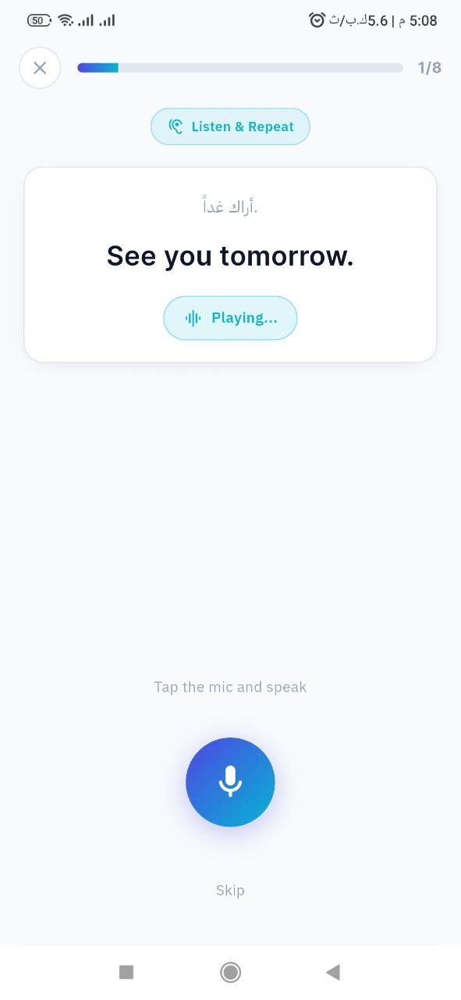 |
| Unread threads raised onto cards, each showing its language pair | Translated message with the original text beneath it | A voice note moving through transcription, translation, and synthesis |

### Calls

| Incoming call | Live translated call |
|:---:|:---:|
| 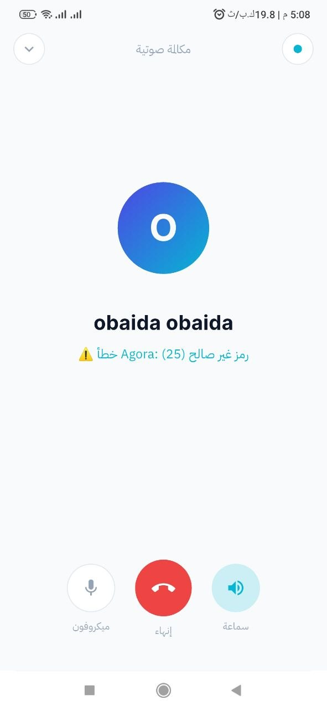 |  |
| Full-screen ring with expanding ripple and accept/reject actions | Real-time captions translated in both directions |

### Practice & Account

| Practice session | Settings | Subscription |
|:---:|:---:|:---:|
| 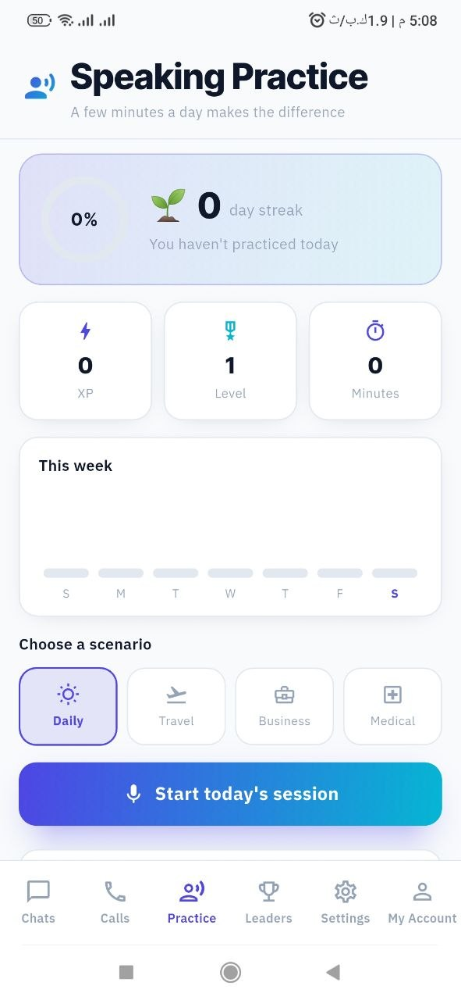 | 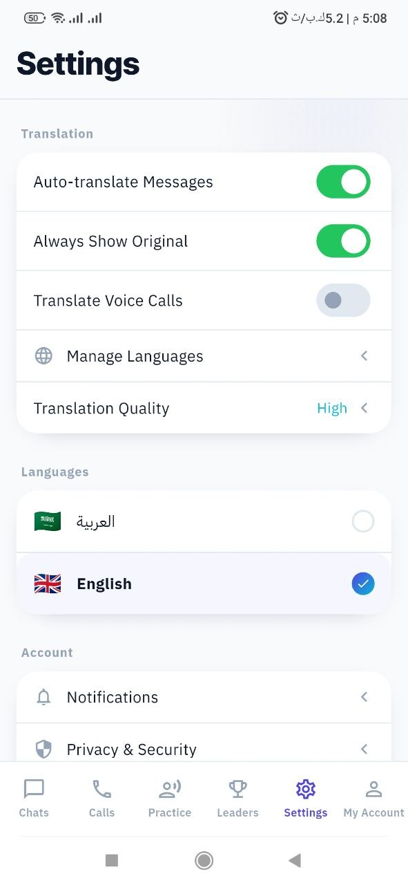 | 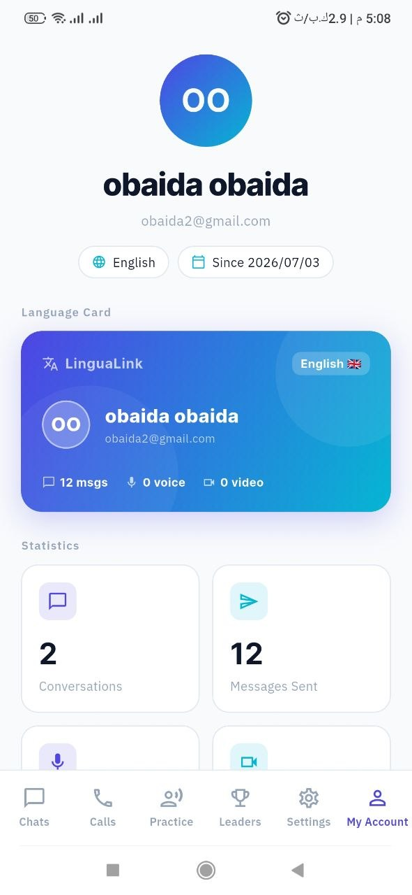 |
| Speaking exercise with reference audio and recording control | Grouped preferences for translation, notifications, and theme | Plan comparison with store-provided pricing |

## Tech Stack

| Layer | Technology |
|---|---|
| Framework | Flutter 3.7 · Dart |
| State / DI / Routing | GetX |
| Backend | Supabase — PostgreSQL, Auth, Storage, Realtime, Edge Functions |
| Authentication | Supabase Auth · Google Sign-In (OAuth ID token) |
| Speech-to-text | OpenAI Whisper (via Edge Function) |
| Machine translation | Google Gemini (via Edge Function), with a fallback provider |
| OCR (image translation) | Server-side `ocr` Edge Function |
| Text-to-speech | ElevenLabs (via Edge Function) |
| Voice & video calls | Agora RTC Engine · WebSocket caption relay |
| Media processing | ffmpeg_kit_flutter_new — audio extraction, subtitle burn-in |
| Push notifications | Firebase Cloud Messaging · flutter_local_notifications |
| Local persistence | SQFlite · SharedPreferences |
| Payments | in_app_purchase — Google Play Billing & StoreKit |

## My Role

I designed and built the entire application — there was no starter codebase beyond `flutter create`.

**Architecture** — GetX for state, routing, and DI, with a strict controller/view split and eleven injectable services resolved at startup. That separation is what later let me re-skin all 18 screens without touching business logic.

**Backend** — PostgreSQL schema on Supabase (users, conversations, messages, reactions, call invitations, call logs, subscriptions) with row-level security on every table, plus a `SECURITY DEFINER` trigger that provisions profiles on signup including OAuth claims. Edge Functions (transcribe, translate, tts, ocr, Agora token, push notifications) keep every third-party API key off the client.

**Translation pipeline** — the multi-stage flow turning a voice note or video into a translated artifact: ffmpeg extracts audio → Whisper transcribes with per-segment timings → Gemini translates → ElevenLabs synthesizes speech, or an SRT is burned back onto the video.

**Live calls** — Agora RTC for transport alongside a WebSocket channel carrying translated captions, with a full invite/ring/accept/reject/missed lifecycle over Supabase Realtime and FCM.

**Groups, OCR & Studio** — multi-language group chat where each member's copy is translated into their own language and delivered live over Realtime, public-group discovery with invite codes, an OCR pipeline for text in photos, and a standalone Studio for any file type.

**Release engineering** — signing, Play Console setup (store listing in four languages, child-safety and account-deletion pages, privacy policy), and shipping the app to production — v1.0 through v1.3.

**Design system & monetization** — a token-based theme layer driving the whole UI from one file, an animation library that respects the OS reduce-motion setting, and subscriptions via `in_app_purchase` with store pricing and the restore flow Apple requires.

## Technical Highlights

**Keeping API keys out of the binary.** Whisper, Gemini, and ElevenLabs credentials never reach the client. All three run behind Supabase Edge Functions invoked with an authenticated session, so decompiling the APK yields nothing useful.

**Resumable multi-stage media pipeline.** Translating a video chains five fallible operations across the device and three external services. Each job is a state machine caching every intermediate result — extracted audio, timed segments, translated strings — so a network failure during translation retries from that step instead of re-running ffmpeg extraction. The same job model backs both chat video messages and the Studio.

**Preserving subtitle timing across translation.** Whisper returns timed segments, but translating the transcript as one block destroys the mapping between text and timestamps. Translating segment by segment and reassembling against the original timings keeps subtitles synchronized even when word order differs substantially between languages.

**Fixing a silent authentication failure.** Profile loading swallowed all exceptions, so a failed read left the user ID unpersisted — the user reached the home screen with an empty session and every downstream feature failed with no error shown. The ID now persists unconditionally, falling back to auth metadata when the profile row can't be read.

**RTL-correct visual design.** The reference design was left-to-right and single-theme. Directional geometry — a chat bubble's tail, spacing between elements — uses `BorderRadiusDirectional` and `EdgeInsetsDirectional` so it mirrors automatically in Arabic, and negative letter-spacing is applied only to Latin text since it breaks Arabic letterform joining.

## Status

✅ **Published on Google Play** — [LinguaLink – Live Translation](https://play.google.com/store/apps/details?id=com.translate.ai), currently at v1.3, with the store listing localized in Arabic, English, Spanish, and Italian. Next on the roadmap: an iOS build (not yet compiled on macOS) and server-side receipt verification for subscriptions.

## Running Locally

Requires a Supabase project with `supabase_schema.sql` applied and the functions in `supabase/functions/` deployed, plus a Firebase project for push notifications.

```bash
flutter pub get && flutter run
```
