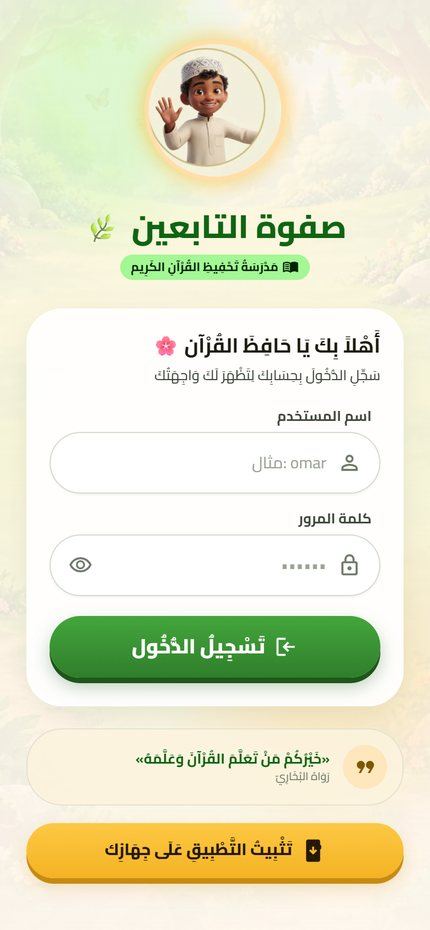
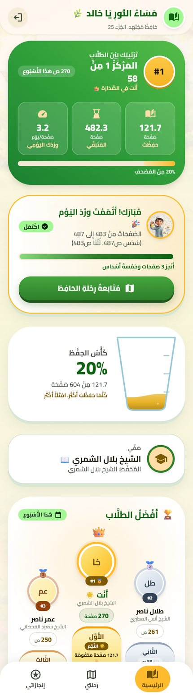
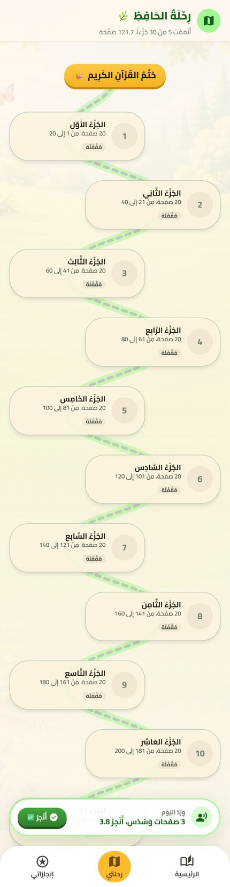
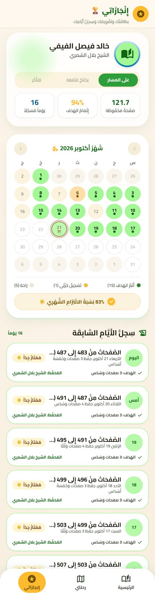
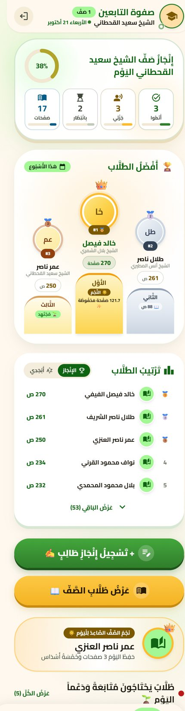
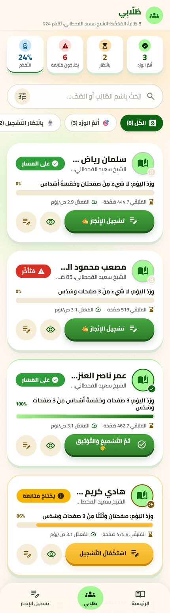
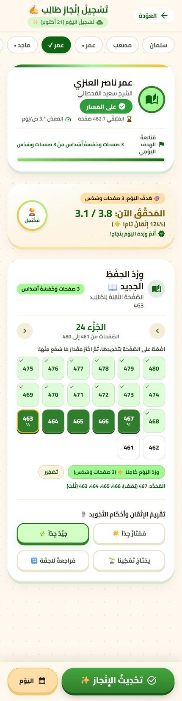
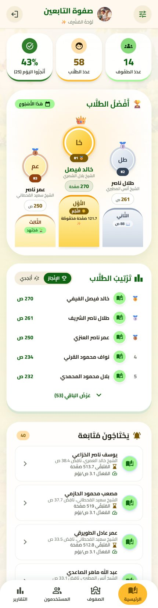
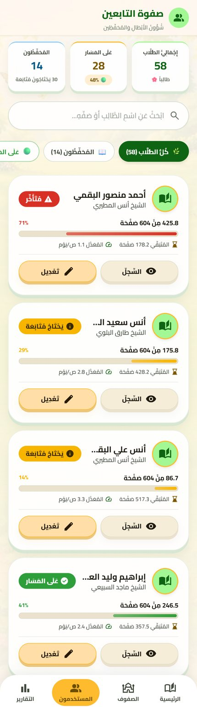
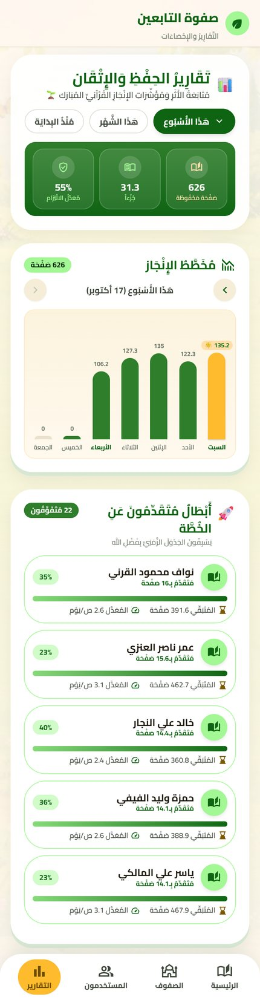

# Safwat Al-Tabieen (صفوة التابعين)

> A fast, installable Arabic web app for tracking Quran memorization day by day — one plan per student, one dashboard per teacher, one overview for the school. A full **Vue 3 + TypeScript rebuild** of my Flutter app, matched to it number for number.

  <a href="https://huffaz-tabieen.netlify.app/"><b>🌐 Live site</b></a> ·
  <a href="https://github.com/ObaidaAlaff/safwa-tabieen-web"><b>💻 Source code</b></a>

## Overview

Safwat Al-Tabieen connects the **student**, the **teacher** (muhaffiz), and the **administrator** of a Quran-memorization school in one app. Each student gets an individual plan: the remaining pages of the Mushaf (604) are spread across 170 study days, skipping rest days, which produces a daily *wird*. Teachers log each recitation by page or fraction of a page, and every student is color-coded — green (on track), yellow (needs follow-up), red (three or more days behind) — alongside a positive ranking between students and classes.

The web version was built for one reason: **speed**. The Flutter web build ships a full rendering engine before it paints anything, which is heavy on mobile data. I rebuilt the web client natively in Vue — same design, same screens, same database — while the Android and iOS apps stay on Flutter.

| | Flutter on web | This rebuild |
|---|---|---|
| First visit (login screen) | ≈ 2.5 MB | ≈ 90 KB JS + 46 KB fonts |
| Login screen on fast 4G | several seconds | ≈ 1.4 s |
| Repeat visits | full reload | under 0.1 s |
| No connection | doesn't open | opens after the first visit |

## My Role

I designed and built the whole product solo — the Flutter app first, then this web rebuild:

- **Planning** — wrote a 9-phase build plan with a hard performance budget (≤ 90 KB JS for the login screen, < 1.5 s on 4G) and treated it as an acceptance criterion.
- **Porting the logic** — translated the plan/standing/date/Juz calculations from Dart to TypeScript, and proved the port with golden tests generated by running the *original Flutter code* on the same data.
- **Front end** — 3 role-based shells, a shared UI component kit, code-split routes, RTL Arabic with diacritics, and a design system taken from the Flutter theme tokens.
- **Backend integration** — consumes the existing Supabase schema, RPC functions and Row Level Security; the administrator creates accounts through an Edge Function.
- **PWA & delivery** — a custom 1 KB service worker, auto-update, offline support, and a scripted Netlify deploy.
- **Quality tooling** — wrote my own scripts for screenshots, accessibility, performance, offline and string-parity checks.

## Key Features

| Role | What it gives them |
|---|---|
| 🎓 **Student** | Auto-computed daily wird, a "memorization cup" showing progress, a 30-Juz journey map, ranking among students, a monthly commitment calendar and daily history |
| 📖 **Teacher** | Class completion indicator for today, quick recitation logging (full page, ⅓, ½, ⅔) with rating and note, back-dated entries, plan editing per student, search and status filters |
| 🛠️ **Administrator** | Project dashboard, class and teacher management, creating/editing/deleting accounts, weekly and monthly memorization & mastery reports, rest days and project settings |
| 🌍 **Everyone** | RTL Arabic UI, install to the home screen, offline after the first visit, pull to refresh, automatic updates |

## Screenshots

> All names and data in these screenshots are fictional — real student names were replaced to protect privacy.

### Student

<table>
  <tr>
    <td align="center"></td>
    <td align="center"></td>
    <td align="center"></td>
    <td align="center"></td>
  </tr>
  <tr>
    <td align="center">Username login with a lightweight pre-render screen</td>
    <td align="center">Rank, memorized pages, daily wird and the memorization cup</td>
    <td align="center">The 30-Juz journey from Juz' Amma to the full Quran</td>
    <td align="center">Monthly commitment calendar and daily history</td>
  </tr>
</table>

### Teacher

<table>
  <tr>
    <td align="center"></td>
    <td align="center"></td>
    <td align="center"></td>
  </tr>
  <tr>
    <td align="center">Today's class completion and top students</td>
    <td align="center">Students with color-coded status, search and filters</td>
    <td align="center">Logging a recitation by page or fraction, with rating and note</td>
  </tr>
</table>

### Administrator

<table>
  <tr>
    <td align="center"></td>
    <td align="center"></td>
    <td align="center"></td>
  </tr>
  <tr>
    <td align="center">Project overview and class ranking</td>
    <td align="center">Creating and managing student and teacher accounts</td>
    <td align="center">Weekly and monthly memorization and mastery reports</td>
  </tr>
</table>

## Tech Stack

| Layer | Technology |
|---|---|
| UI | Vue 3 (`<script setup>`) + TypeScript |
| Tooling | Vite, `vue-tsc` (strict), Vitest |
| Routing | vue-router with role-based guards |
| Backend | Supabase — Postgres, Auth, RPC metrics functions, an Edge Function for account management |
| Client | `auth-js` + `postgrest-js` instead of the full SDK (≈ 30 KB saved) |
| Fonts | Cairo subset to Arabic + digits (≈ 22 KB per weight), Amiri for the Quranic verse only |
| Icons | 85 inline SVGs extracted from the same Material Symbols file Flutter uses |
| Offline | Custom Vite plugin generating a ≈ 1 KB service worker — no Workbox |
| Hosting | Netlify (static site + SPA redirects, year-long caching for hashed assets) |

## Technical Highlights

- **Provable parity with the Flutter app.** Business logic (status colors, wird, dates, Juz progress) was ported from Dart and verified with **93 golden tests** whose expected values come from running the real Flutter code on the same 58-student dataset — so the two clients can't silently drift apart.
- **A performance budget, enforced.** Role-based code splitting (an admin never downloads student code), lazy secondary screens, a pure-HTML splash before the app boots, and non-render-blocking CSS got the login screen to ≈ 90 KB of JS and ≈ 1.4 s on simulated 4G.
- **App-like feel in the browser.** Main tabs stay alive with `KeepAlive`, modal pages open with a zoom transition, and the back button behaves like on mobile (inner page → role home first).
- **Zero-friction updates.** A new deploy activates the new service worker immediately and reloads the page once; updates are also checked every time the user returns to the app.
- **Arabic typography details.** Fixed the clipping of final-yeh dots that the font produces under `overflow: hidden`, while keeping text-overflow ellipsis intact.
- **Privacy by design.** A dev-only preview mode renders every screen with generated demo data — no sign-in, no writes — and is stripped from the production build; demo data uses fictional names only.
- **Self-built QA toolchain.** Scripted checks for accessibility (0 issues across 11 screens), offline opening (0.07 s), string parity with Flutter (509 Arabic strings), and mobile-width screenshots.

## Status

✅ **Live** — the web app runs on Netlify, source on [GitHub](https://github.com/ObaidaAlaff/safwa-tabieen-web).
📱 The Flutter Android/iOS app shares the same Supabase backend; its Play Store and App Store listing materials are prepared.
